<h1 align='center'>
    Portfólio
    <br />
    <br />
    
</h1>
<br />

## Tecnologias 🧪
O [Portfólio](https://portfolio2-pdd.vercel.app) foi desenvolovido com as seguintes tecnologias:

- [Next.JS](https://nextjs.org/)
- [Typescript](https://www.typescriptlang.org/)
- [Chakra UI](https://www.chakra-ui.com/)

## Como executar 
Para executar o projeto localmente, siga os seguintes passos:

```bash
$ git clone https://github.com/pdanmt/Portfolio2

$ cd Portfolio2
```
Para inicializar o projeto, utilize o npm:
```bash
# Instale as dependências
$ npm i

$ npm run dev
```
A aplicação será aberta no seu navegador padrão no endereço http://localhost:3000, caso a porta 3000 não esteja sendo utilizada.

## Layout 📝
O design utilizado no Portfólio foi feito pela [Rocketseat](https://www.rocketseat.com.br/) e pode ser acessado no seguinte link:

[Figma do projeto](https://www.figma.com/community/file/1387080701963671866/portfolio-dev)